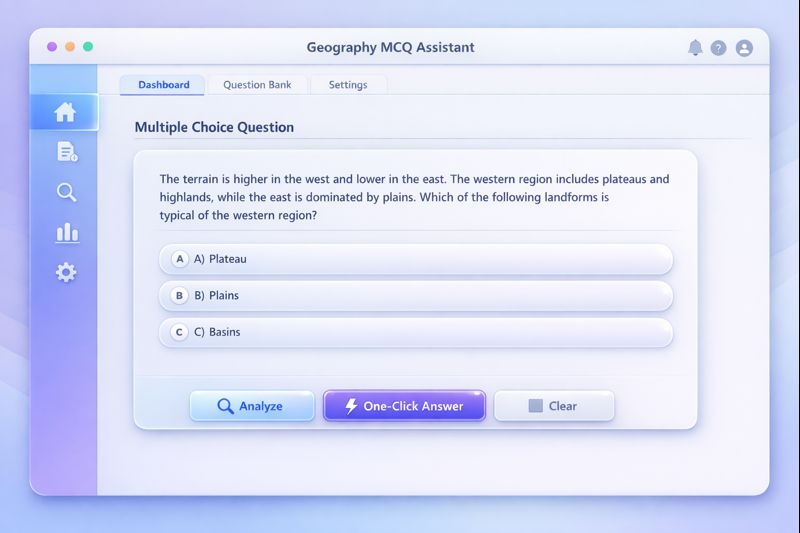
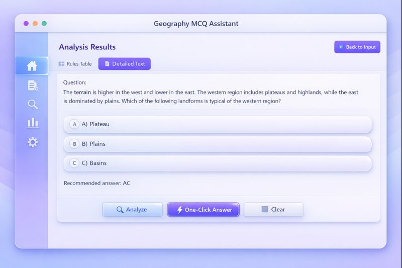
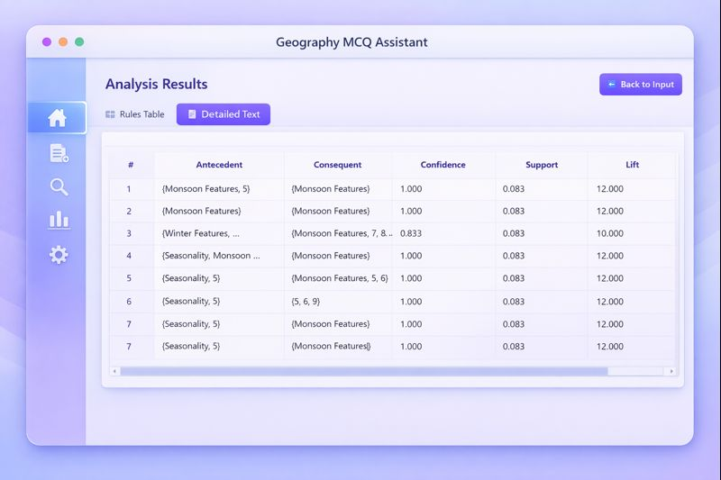

# Automated-GMCQs-Answering

高中地理选择题自动解答系统。项目面向高中地理单选题与多选题，结合领域词典、关键词抽取、实体属性关联、形式背景构建、三支概念格计算与规则抽取，实现批量自动推理与准确率评估。

[中文说明](#中文说明) | [English Summary](#english-summary)

## 中文说明

### 项目概览

本项目当前以 `batch_evaluate.py` 为统一入口，支持对结构化地理题库进行批量评测。整体流程如下：

1. 从题干中抽取地理关键词，并结合同义词表与领域词典进行规范化映射。
2. 基于题干关键词和选项构建对象集、属性集与决策形式背景。
3. 调用三支概念格算法生成条件概念与决策概念。
4. 对决策结果做索引偏移修正，并合并条件域/决策域概念。
5. 从概念结果中提取高置信规则，并基于“直接证据 + 规则证据 + 组合证据”完成答案预测。
6. 输出逐题报告、规则分析结果与整套题库的整体准确率。

### 当前能力

- 支持单选题与多选题两种模式。
- 支持按学科类别分别加载词典与题库。
- 支持否定式单选题识别，如“不正确”“不属于”等。
- 支持多选题组合证据打分、错误选项抑制与语义桥接。
- 支持用脚本自动扩充 `dict_single/` 和 `dict_multiple/` 词典。
- 支持用 `paint.py` 生成方法对比图。

### 系统界面

#### 界面 1


#### 界面 2


#### 界面 3


#### 界面 4


### 核心文件说明

- `batch_evaluate.py`: 主控入口，串联整条评测链路并输出 `test_results/batch_evaluation_summary.txt`。
- `geo_keyword_extractor.py`: 负责关键词抽取、同义词映射和领域词典加载。
- `entity_attribute.py`: 构建实体关联、属性集合及选项语义支持信息。
- `formal_context_builder.py`: 生成决策形式背景矩阵与中间文件。
- `threeWcl.py`: 三支概念格计算主过程。
- `process_result_decision.py`: 对决策概念结果做条件属性偏移修正。
- `merge_concepts.py`: 合并条件概念与决策概念，生成匹配结果。
- `extract_three_way_rules_enhanced.py`: 提取规则并计算规则强度。
- `enrich_single_dictionaries.py`: 根据单选题库补强 `dict_single/`。
- `enrich_multiple_dictionaries.py`: 根据多选题库和已有词典补强 `dict_multiple/`。
- `paint.py`: 绘制当前项目中的方法对比图，输出到 `figures/`。

### 目录结构

```text
.
├── batch_evaluate.py
├── geo_keyword_extractor.py
├── entity_attribute.py
├── formal_context_builder.py
├── threeWcl.py
├── process_result_decision.py
├── merge_concepts.py
├── extract_three_way_rules_enhanced.py
├── enrich_single_dictionaries.py
├── enrich_multiple_dictionaries.py
├── paint.py
├── README.md
├── CHANGELOG.md
├── geo_synonyms.csv
├── geography_category_Chinese2English.txt
├── single_questions/
├── multiple_questions/
├── dict_single/
├── dict_multiple/
├── test_contexts/
├── test_results/
├── figures/
├── interface_photo/
├── old_dictionarys/
└── util/
```

### 支持的学科类别

| 学科类别 | 题库文件名 | 词典文件名 |
| --- | --- | --- |
| Climatology | `Climatology.json` | `Climatology.csv` |
| Geographical Processes and Principles | `Geographical Processes and Principles.json` | `GPP.csv` |
| Human and Economic Geography | `Human and Economic Geography.json` | `HEG.csv` |
| Hydrology | `Hydrology.json` | `Hydrology.csv` |
| Soil and Vegetation | `Soil and Vegetation.json` | `SV.csv` |
| Topography and Geomorphology | `Topography and Geomorphology.json` | `TG.csv` |

### 运行环境

- Python `3.10.13`
- 建议在项目根目录运行以下命令

安装依赖：

```bash
pip install pandas numpy jieba matplotlib
```

### 快速开始

#### 1. 运行单选题评测

```bash
python batch_evaluate.py single_questions/Climatology.json -d dict_single/Climatology.csv
```

#### 2. 运行多选题评测

```bash
python batch_evaluate.py multiple_questions/Climatology.json -d dict_multiple/Climatology.csv
```

#### 3. 批量补强词典

更新单选词典：

```bash
python enrich_single_dictionaries.py
```

更新多选词典：

```bash
python enrich_multiple_dictionaries.py
```

#### 4. 绘制对比图

```bash
python paint.py
```

图片会输出到：

```text
figures/method_vs_llm_dumbbell.png
figures/method_vs_llm_dumbbell.pdf
```

### 输入数据格式

题库采用 JSON 格式，顶层字段为 `geography_questions`。单题结构示例：

```json
{
  "id": 1,
  "type": "single",
  "geography_category": "Climatology",
  "difficulty": "medium",
  "question": "题干文本",
  "options": {
    "A": "选项A",
    "B": "选项B",
    "C": "选项C"
  },
  "correct_answer": ["A"],
  "explanation": "解析文本"
}
```

多选题只需将 `type` 设为 `"multiple"`，并在 `correct_answer` 中填入多个标签，例如 `["A", "B", "C"]`。

### 输出结果

运行 `batch_evaluate.py` 后，项目会在 `test_contexts/` 和 `test_results/` 中生成中间文件与最终报告，典型输出包括：

- `test_contexts/decision_formal_context.csv`
- `test_contexts/decision_formal_context_condition.txt`
- `test_contexts/decision_formal_context_decision.txt`
- `test_results/threeWcl_condition.txt`
- `test_results/threeWcl_decision.txt`
- `test_results/threeWcl_decision_processed.txt`
- `test_results/merged_three_way_concepts.txt`
- `test_results/enhanced_rules_analysis.txt`
- `test_results/batch_evaluation_summary.txt`

其中 `test_results/batch_evaluation_summary.txt` 会汇总：

- 每道题的题干、选项、标准答案和预测答案
- 各选项的综合得分、直接证据得分、规则证据得分
- 当前题目抽取出的规则数量
- 每条规则的前件、后件、置信度与规则强度
- 整套题库的总题数、答对题数与整体准确率

### 使用说明与注意事项

- 建议始终显式传入 `-d` 指定词典文件。虽然脚本允许省略该参数，但当前仓库内默认后备词典名与现有目录结构并不完全一致，显式指定最稳妥。
- `single_questions/` 与 `multiple_questions/` 中的文件名和 `dict_single/`、`dict_multiple/` 中的词典应按学科类别对应使用。
- 运行批处理时，脚本会清理旧的中间结果文件，以避免上一题残留结果污染当前分析。
- `test_results/` 中保留了一些历史评测结果，可用于回归对比。
- 更细的更新背景和性能优化记录见 [CHANGELOG.md](CHANGELOG.md)。

### 最近更新重点

结合当前仓库内容，近期版本主要包括以下变化：

- 强化了多选题的评分与决策逻辑，引入组合证据和错误选项抑制机制。
- 扩充了 `dict_multiple/` 与 `dict_single/` 六个学科词典的覆盖范围。
- 优化了关键词抽取、相似度计算、规则提取和三支概念格计算性能。
- 新增或完善了项目内的结果可视化脚本 `paint.py`。

## English Summary

This repository is an automated answering system for high-school geography multiple-choice questions, including both single-choice and multiple-choice settings.

The current pipeline is centered on `batch_evaluate.py`:

1. Extract keywords from the question stem with domain dictionaries and synonyms.
2. Build entity relations and decision formal contexts.
3. Run three-way concept lattice computation.
4. Post-process and merge condition/decision concepts.
5. Extract high-confidence rules and predict answers with direct, rule-based, and combination evidence.
6. Save detailed reports to `test_results/`.

Quick examples:

```bash
python batch_evaluate.py single_questions/Climatology.json -d dict_single/Climatology.csv
python batch_evaluate.py multiple_questions/Climatology.json -d dict_multiple/Climatology.csv
python enrich_single_dictionaries.py
python enrich_multiple_dictionaries.py
python paint.py
```

Key outputs:

- `test_results/batch_evaluation_summary.txt`
- `test_results/enhanced_rules_analysis.txt`
- `test_results/merged_three_way_concepts.txt`
- `figures/method_vs_llm_dumbbell.png`

For detailed change history, see [CHANGELOG.md](CHANGELOG.md).
